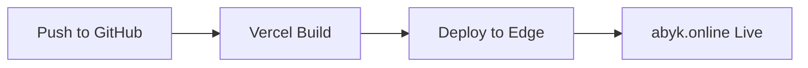

# לוגיקה טכנית וארכיטקטורה | TECHNICAL LOGIC

מסמך מאוחד לראוטינג, state management, APIs, PWA, וביצועים  
**גרסה:** 2.0  
**תאריך:** 26.10.2025

---

## 🏗️ ארכיטקטורה כללית

### Stack טכנולוגי

| טכנולוגיה      | גרסה   | תפקיד                 |
| -------------- | ------ | --------------------- |
| **Astro**      | 5.15.1 | Framework ראשי - SSG  |
| **React**      | 18+    | Islands אינטראקטיביים |
| **TypeScript** | 5+     | Type safety           |
| **pnpm**       | 9+     | Package manager       |
| **Vercel**     | -      | Deployment + CDN      |

### עקרון Islands Architecture

```
┌────────────────────────────────┐
│   Static HTML (Astro SSG)      │
│                                │
│   ┌──────────┐  ┌──────────┐  │
│   │ Island 1 │  │ Island 2 │  │ ← React components
│   │ (React)  │  │ (React)  │  │   with client:* directives
│   └──────────┘  └──────────┘  │
│                                │
│   Static content...            │
└────────────────────────────────┘
```

**מה זה Islands?**

- רוב העמוד = HTML סטטי (אפס JavaScript)
- רק קומפוננטות ספציפיות מקבלות JS
- Hydration סלקטיבי (לא כל העמוד)

**יתרונות:**

- ⚡ טעינה מהירה (פחות JS)
- 🎯 JavaScript רק איפה שצריך
- 📦 Bundle size קטן

---

## 🗺️ Routing (ניתוב)

### מבנה קבצים

Astro משתמש ב-**file-based routing**:

```
src/pages/
├── index.astro                    → /
├── login.astro                    → /login
├── legal.astro                    → /legal
└── tools/
    └── wealth-code/
        ├── calculator.astro       → /tools/wealth-code/calculator
        └── result.astro           → /tools/wealth-code/result
```

### דינמי Routes (אופציונלי)

```
src/pages/
└── blog/
    └── [slug].astro              → /blog/any-slug
```

**קריאת params:**

```astro
---
// src/pages/blog/[slug].astro
const { slug } = Astro.params;
---
<h1>Post: {slug}</h1>
```

### Navigation

**קישורים רגילים:**

```astro
<a href="/tools/wealth-code/calculator">מחשבון</a>
```

**עם prefetch (מומלץ):**

```astro
<a href="/calculator" data-astro-prefetch>מחשבון</a>
```

**הגדרה:**

```js
// astro.config.mjs
export default defineConfig({
  prefetch: true,
});
```

---

## 🔄 State Management

### 1. React State (בתוך Islands)

```tsx
// src/components/Calculator.tsx
import { useState } from 'react';

export default function Calculator() {
  const [date, setDate] = useState<string>('');
  const [result, setResult] = useState<string | null>(null);

  const handleCalculate = () => {
    // Logic here
    setResult('12-34-56');
  };

  return (
    <div>
      <input value={date} onChange={(e) => setDate(e.target.value)} />
      <button onClick={handleCalculate}>חשב</button>
      {result && <p>הקוד שלך: {result}</p>}
    </div>
  );
}
```

### 2. localStorage (Client-side persistence)

```ts
// src/utils/storage.ts
export const storage = {
  get<T>(key: string): T | null {
    if (typeof window === 'undefined') return null;
    const item = localStorage.getItem(key);
    return item ? JSON.parse(item) : null;
  },

  set<T>(key: string, value: T): void {
    if (typeof window === 'undefined') return;
    localStorage.setItem(key, JSON.stringify(value));
  },

  remove(key: string): void {
    if (typeof window === 'undefined') return;
    localStorage.removeItem(key);
  },
};
```

**שימוש:**

```tsx
import { storage } from '@/utils/storage';

// Save
storage.set('theme', 'dark');

// Load
const theme = storage.get<string>('theme');
```

### 3. URL State (Query params)

```tsx
// src/components/SearchFilter.tsx
import { useEffect, useState } from 'react';

export default function SearchFilter() {
  const [query, setQuery] = useState('');

  useEffect(() => {
    const params = new URLSearchParams(window.location.search);
    setQuery(params.get('q') || '');
  }, []);

  const handleSearch = (newQuery: string) => {
    setQuery(newQuery);
    const url = new URL(window.location.href);
    url.searchParams.set('q', newQuery);
    window.history.pushState({}, '', url);
  };

  return <input value={query} onChange={(e) => handleSearch(e.target.value)} />;
}
```

---

## 📡 APIs & Data Fetching

### Astro Server-side (Build time)

```astro
---
// src/pages/blog/index.astro
// Runs at BUILD time (SSG)
const posts = await fetch('https://api.example.com/posts')
  .then(res => res.json());
---

<ul>
  {posts.map(post => (
    <li>{post.title}</li>
  ))}
</ul>
```

### React Client-side (Runtime)

```tsx
// src/components/DataFetcher.tsx
import { useEffect, useState } from 'react';

export default function DataFetcher() {
  const [data, setData] = useState(null);
  const [loading, setLoading] = useState(true);

  useEffect(() => {
    fetch('https://api.example.com/data')
      .then((res) => res.json())
      .then((data) => {
        setData(data);
        setLoading(false);
      });
  }, []);

  if (loading) return <p>טוען...</p>;

  return <div>{JSON.stringify(data)}</div>;
}
```

### Wealth Code Algorithm

```ts
// wealth-code/utils/algorithm.ts
export function calculateWealthCode(birthDate: Date): string {
  const day = birthDate.getDate();
  const month = birthDate.getMonth() + 1;
  const year = birthDate.getFullYear();

  // Example logic (replace with actual algorithm)
  const code1 = (day + month) % 10;
  const code2 = (month + year) % 10;
  const code3 = (day + year) % 10;

  return `${code1}${code2}-${code3}${code1}-${code2}${code3}`;
}
```

**שימוש:**

```tsx
import { calculateWealthCode } from '@/wealth-code/utils/algorithm';

const code = calculateWealthCode(new Date('1990-05-15'));
console.log(code); // "12-34-56"
```

---

## 📱 PWA (Progressive Web App)

### manifest.json

```json
{
  "name": "Awakening by Ksenia - קוד העושר",
  "short_name": "ABYK",
  "description": "גלו את קוד העושר האישי שלכם",
  "start_url": "/",
  "display": "standalone",
  "orientation": "portrait",
  "dir": "rtl",
  "lang": "he",
  "theme_color": "#aa7c7c",
  "background_color": "#fcfcfc",
  "icons": [
    {
      "src": "/icon-192.png",
      "sizes": "192x192",
      "type": "image/png",
      "purpose": "maskable any"
    },
    {
      "src": "/icon-512.png",
      "sizes": "512x512",
      "type": "image/png",
      "purpose": "maskable any"
    }
  ]
}
```

**מיקום:** `public/manifest.json`

### Service Worker (בסיסי)

```js
// public/sw.js
const CACHE_NAME = 'abyk-v1';
const URLS_TO_CACHE = [
  '/',
  '/tools/wealth-code/calculator',
  '/styles/global.css',
];

self.addEventListener('install', (event) => {
  event.waitUntil(
    caches.open(CACHE_NAME).then((cache) => {
      return cache.addAll(URLS_TO_CACHE);
    })
  );
});

self.addEventListener('fetch', (event) => {
  event.respondWith(
    caches.match(event.request).then((response) => {
      return response || fetch(event.request);
    })
  );
});
```

### רישום Service Worker

```astro
---
// src/layouts/BaseLayout.astro
---
<script>
  if ('serviceWorker' in navigator) {
    navigator.serviceWorker.register('/sw.js');
  }
</script>
```

### כפתור התקנה (InstallPWA)

```tsx
// src/components/InstallPWA.tsx
import { useEffect, useState } from 'react';

export default function InstallPWA() {
  const [deferredPrompt, setDeferredPrompt] = useState<any>(null);
  const [showButton, setShowButton] = useState(false);

  useEffect(() => {
    const handler = (e: Event) => {
      e.preventDefault();
      setDeferredPrompt(e);
      setShowButton(true);
    };

    window.addEventListener('beforeinstallprompt', handler);

    return () => window.removeEventListener('beforeinstallprompt', handler);
  }, []);

  const handleInstall = async () => {
    if (!deferredPrompt) return;

    deferredPrompt.prompt();
    const { outcome } = await deferredPrompt.userChoice;

    if (outcome === 'accepted') {
      setShowButton(false);
    }

    setDeferredPrompt(null);
  };

  if (!showButton) return null;

  return <button onClick={handleInstall}>שמירה למסך הבית</button>;
}
```

**שימוש:**

```astro
<InstallPWA client:load />
```

### Meta Tags נדרשים

```astro
---
// src/layouts/BaseLayout.astro
---
<head>
  <meta name="viewport" content="width=device-width, initial-scale=1.0, viewport-fit=cover">
  <meta name="mobile-web-app-capable" content="yes">
  <meta name="apple-mobile-web-app-capable" content="yes">
  <meta name="apple-mobile-web-app-status-bar-style" content="black-translucent">
  <meta name="theme-color" content="#aa7c7c">
  <link rel="manifest" href="/manifest.json">
  <link rel="apple-touch-icon" href="/icon-192.png">
</head>
```

### Safe Areas (iOS)

```css
/* src/styles/global.css */
body {
  padding-top: env(safe-area-inset-top);
  padding-right: env(safe-area-inset-right);
  padding-bottom: env(safe-area-inset-bottom);
  padding-left: env(safe-area-inset-left);
}

.fixed-footer {
  bottom: env(safe-area-inset-bottom);
  padding-bottom: calc(0.75rem + env(safe-area-inset-bottom));
}
```

---

## ⚡ Performance Optimization

### 1. JavaScript Strategy

**Zero JS על עמודים סטטיים:**

```astro
<!-- src/pages/index.astro -->
<!-- אין React components = אפס JavaScript -->
<h1>עמוד הבית</h1>
<p>תוכן סטטי</p>
```

**Selective Hydration:**

```astro
<!-- טוען מיד -->
<ThemeToggle client:load />

<!-- טוען אחרי idle -->
<ShareButton client:idle />

<!-- טוען כשנכנס לviewport -->
<Calculator client:visible />
```

### 2. Code Splitting

Astro מבצע אוטומטית:

- כל עמוד = chunk נפרד
- כל island = chunk נפרד

**תוצאה:**

```
dist/_astro/
  Calculator-abc123.js     # רק בעמוד המחשבון
  ThemeToggle-def456.js    # בכל עמוד (כי יש בכל מקום)
  index-xyz789.js          # קוד ספציפי לדף הבית
```

### 3. Image Optimization

```astro
---
import { Image } from 'astro:assets';
import heroImg from '../assets/hero.png';
---

<Image
  src={heroImg}
  alt="Hero"
  width={800}
  height={600}
  format="webp"
  quality={80}
  loading="lazy"
/>
```

**יתרונות:**

- ✅ WebP/AVIF אוטומטי
- ✅ Lazy loading ברירת מחדל
- ✅ `width`/`height` מונע layout shift

### 4. Font Loading

```html
<link rel="preconnect" href="https://fonts.googleapis.com" />
<link rel="preconnect" href="https://fonts.gstatic.com" crossorigin />
<link
  href="https://fonts.googleapis.com/css2?family=Assistant:wght@300;400;600;800&display=swap"
  rel="stylesheet"
/>
```

**`display=swap`** = מציג fallback font מיד, מחליף כש-Assistant נטען

### 5. Prefetch Links

```astro
<a href="/calculator" data-astro-prefetch>
  מחשבון
</a>
```

**התנהגות:** על hover, Astro טוען את העמוד ברקע

### 6. CSS Optimization

**Tailwind Purge:**

```js
// tailwind.config.js
export default {
  content: ['./src/**/*.{astro,html,js,jsx,ts,tsx}'],
  // ייצור: רק classes בשימוש נשמרים
};
```

**Critical CSS:**
Astro inline אוטומטית CSS קריטי לעמוד

---

## 📊 Performance Targets

### Core Web Vitals

| מדד                                | יעד     | ציון Lighthouse |
| ---------------------------------- | ------- | --------------- |
| **FCP** (First Contentful Paint)   | < 1.2s  | Good            |
| **LCP** (Largest Contentful Paint) | < 2.5s  | Good            |
| **TBT** (Total Blocking Time)      | < 200ms | Good            |
| **CLS** (Cumulative Layout Shift)  | < 0.1   | Good            |
| **SI** (Speed Index)               | < 3.4s  | Good            |

### Lighthouse Goals

- ⚡ Performance: **>95**
- ♿ Accessibility: **100**
- 🎯 Best Practices: **100**
- 🔍 SEO: **100**

### בדיקה

```bash
# Build production
pnpm build

# Serve locally
pnpm preview

# Open Chrome DevTools → Lighthouse
# Run audit on http://localhost:4321
```

---

## 🚀 Deployment (Vercel)

### Build Settings

| Setting              | Value          |
| -------------------- | -------------- |
| **Framework**        | Astro          |
| **Build Command**    | `pnpm build`   |
| **Output Directory** | `dist`         |
| **Install Command**  | `pnpm install` |
| **Node Version**     | 20.x           |

### Environment Variables

```bash
# Production only
PUBLIC_SITE_URL=https://abyk.online

# All environments
PUBLIC_ANALYTICS_ID=va_abc123
```

**גישה:**

```ts
const siteUrl = import.meta.env.PUBLIC_SITE_URL;
```

### Deployment Flow



**אוטומטי:**

1. Push ל-`main` → deploy production
2. Push ל-`feature/*` → preview deployment
3. PR → Vercel comment עם preview URL

### Rollback

```bash
# Via CLI
vercel ls                    # רשימת deployments
vercel promote <deployment>  # rollback לגרסה קודמת
```

---

## 🔐 Security Headers

```json
// vercel.json
{
  "headers": [
    {
      "source": "/(.*)",
      "headers": [
        {
          "key": "X-Content-Type-Options",
          "value": "nosniff"
        },
        {
          "key": "X-Frame-Options",
          "value": "DENY"
        },
        {
          "key": "Referrer-Policy",
          "value": "strict-origin-when-cross-origin"
        },
        {
          "key": "Permissions-Policy",
          "value": "geolocation=(), microphone=(), camera=()"
        }
      ]
    }
  ]
}
```

---

## 📧 Email & PDF Generation

### Email Sending

```ts
// wealth-code/email/index.ts
import { WealthEmail } from './WealthEmail';
import { render } from '@react-email/render';

export async function sendWealthCodeEmail(
  to: string,
  code: string,
  name: string
) {
  const html = render(WealthEmail({ code, name }));

  // Send via API (Resend, SendGrid, etc.)
  const response = await fetch('https://api.resend.com/emails', {
    method: 'POST',
    headers: {
      Authorization: `Bearer ${API_KEY}`,
      'Content-Type': 'application/json',
    },
    body: JSON.stringify({
      from: 'awakening.by.ksenia@gmail.com',
      to,
      subject: `קוד העושר האישי שלכם מ-Awakening by Ksenia ✨`,
      html,
    }),
  });

  return response.json();
}
```

### PDF Generation

```tsx
// wealth-code/pdf/WealthReport.tsx
import { Document, Page, Text, View, StyleSheet } from '@react-pdf/renderer';

const styles = StyleSheet.create({
  page: { padding: 30 },
  title: { fontSize: 24, marginBottom: 20 },
  body: { fontSize: 12, lineHeight: 1.6 },
});

export function WealthReport({ code, name }: { code: string; name: string }) {
  return (
    <Document>
      <Page size="A4" style={styles.page}>
        <View>
          <Text style={styles.title}>קוד העושר שלך: {code}</Text>
          <Text style={styles.body}>שלום {name},</Text>
          <Text style={styles.body}>הפירוש המלא של הקוד שלך...</Text>
        </View>
      </Page>
    </Document>
  );
}
```

**יצירת PDF:**

```ts
import { pdf } from '@react-pdf/renderer';
import { WealthReport } from './WealthReport';

const blob = await pdf(<WealthReport code="12-34-56" name="יוסי" />).toBlob();
```

---

## 🧪 Testing Strategy

### 1. Type Checking

```bash
pnpm typecheck
```

### 2. Linting

```bash
pnpm lint
```

### 3. Build Test

```bash
pnpm build
# בדיקה שאין שגיאות build
```

### 4. Visual Testing

```bash
pnpm preview
# בדיקה ידנית של עמודים במצב production
```

---

## 📝 File Structure

```
src/
├── components/           # React components
│   ├── Calculator.tsx
│   ├── ThemeToggle.tsx
│   └── InstallPWA.tsx
├── layouts/              # Astro layouts
│   └── BaseLayout.astro
├── pages/                # Routes (file-based)
│   ├── index.astro
│   ├── login.astro
│   └── tools/
│       └── wealth-code/
│           └── calculator.astro
├── styles/               # Global CSS
│   ├── tokens.css
│   └── global.css
└── utils/                # Helper functions
    └── storage.ts

wealth-code/              # Business logic
├── data/                 # ⚠️ PROTECTED - אין לשנות
│   ├── digitInterpretations.ts
│   └── dailyApplication.ts
├── utils/
│   ├── algorithm.ts
│   └── numerology.ts
├── email/
│   └── WealthEmail.tsx
└── pdf/
    └── WealthReport.tsx

public/                   # Static assets
├── manifest.json
├── sw.js
├── icon-192.png
└── icon-512.png
```

---

## 🔧 פתרון בעיות ידועות

### בעיית ניווט לעמוד פירושים (Interpretations Navigation Issue)

**תיאור הבעיה:**
כפתור "צפייה באתר" בעמוד התודה לא מעביר לעמוד הפירושים עם קוד, אלא עושה redirect למחשבון.

**סיבות שורש:**

1. **Hydration Mismatch:** קומפוננטת React מרנדרת בצד השרת עם state ריק, ורק אחרי hydration בצד הלקוח ה-`useEffect` רץ ומעדכן את הקוד
2. **Service Worker Cache:** PWA Service Worker שומר גרסאות ישנות של הקוד גם אחרי שינויים
3. **Server-side Redirect:** עמוד `interpretations.astro` ביצע redirect בצד השרת לפני שהלקוח הצליח לטעון את הקוד מ-sessionStorage

**הפתרון שיושם:**

#### 1. ThankYouActions.tsx - ניווט בצד לקוח

```tsx
// ✅ פתרון
export default function ThankYouActions({
  code: initialCode,
}: ThankYouActionsProps) {
  const [code, setCode] = useState(initialCode || '');
  const [interpretationsHref, setInterpretationsHref] = useState(
    '/tools/wealth-code/interpretations'
  );

  useEffect(() => {
    // מושך קוד מ-prop או מ-sessionStorage
    let resolvedCode = initialCode || '';
    if (!resolvedCode && typeof window !== 'undefined') {
      const saved = sessionStorage.getItem('abyk:last-code');
      if (saved) {
        resolvedCode = saved;
      }
    }

    if (resolvedCode) {
      sessionStorage.setItem('abyk:last-code', resolvedCode);
      setCode(resolvedCode);
      if (/^\d{4}$/.test(resolvedCode)) {
        setInterpretationsHref(
          `/tools/wealth-code/interpretations?code=${resolvedCode}`
        );
      }
    }
  }, [initialCode]);

  return (
    <a
      href="#"
      onClick={(e) => {
        e.preventDefault();
        window.location.href = interpretationsHref;
      }}
      className="btn btn-cta"
    >
      צפייה באתר
    </a>
  );
}
```

**למה זה עובד:**

- ה-`onClick` רץ רק אחרי hydration מלא
- ה-`interpretationsHref` כבר מעודכן עם הקוד הנכון מתוך `useEffect`
- `preventDefault()` מונע ניווט ל-`#`

#### 2. InterpretationsTabs.tsx - חילוץ קוד בצד לקוח

```tsx
// ✅ פתרון
export default function InterpretationsTabs({
  code: initialCode,
}: InterpretationsTabsProps) {
  const [code, setCode] = useState(initialCode ?? '');
  const [isResolved, setIsResolved] = useState(!!initialCode);

  useEffect(() => {
    let resolvedCode = '';

    // 1. נסה מה-prop
    if (initialCode && /^\d{4}$/.test(initialCode)) {
      resolvedCode = initialCode;
    }
    // 2. נסה מה-URL
    else if (typeof window !== 'undefined') {
      const urlCode = new URLSearchParams(window.location.search).get('code');
      if (urlCode && /^\d{4}$/.test(urlCode)) {
        resolvedCode = urlCode;
      }
      // 3. נסה מ-sessionStorage
      else {
        const stored = sessionStorage.getItem('abyk:last-code');
        if (stored && /^\d{4}$/.test(stored)) {
          resolvedCode = stored;
          // עדכן את ה-URL
          const searchParams = new URLSearchParams(window.location.search);
          searchParams.set('code', stored);
          const updatedUrl = `${
            window.location.pathname
          }?${searchParams.toString()}`;
          window.history.replaceState({}, '', updatedUrl);
        }
      }
    }

    if (resolvedCode) {
      sessionStorage.setItem('abyk:last-code', resolvedCode);
      setCode(resolvedCode);
    }

    setIsResolved(true);
  }, [initialCode]);

  // טעינה...
  if (!isResolved) {
    return <div>טוען את הפירוש המלא...</div>;
  }

  // אין קוד תקין
  if (!code || !/^\d{4}$/.test(code)) {
    return (
      <div>
        <h2>לא נמצא קוד תקין</h2>
        <a href="/tools/wealth-code/calculator">חזרה למחשבון</a>
      </div>
    );
  }

  // הצג פירושים...
}
```

**למה זה עובד:**

- מחפש את הקוד ב-3 מקומות: prop → URL → sessionStorage
- מעדכן את ה-URL אם הקוד נמצא רק ב-sessionStorage
- מציג loading state עד שמזהה אם יש קוד או לא

#### 3. interpretations.astro - ביטול redirect בשרת

```astro
---
// ❌ לפני (עשה redirect בשרת)
const code = url.searchParams.get('code');
if (!code || !/^\d{4}$/.test(code)) {
  return Astro.redirect('/tools/wealth-code/calculator');
}

// ✅ אחרי (נותן לקומפוננטה לטפל)
const rawCode = url.searchParams.get('code');
const isValidCode = rawCode && /^\d{4}$/.test(rawCode);
const displayCode = isValidCode ? rawCode : undefined;
---

<InterpretationsTabs code={displayCode} client:load />
```

**למה זה עובד:**

- השרת לא עושה redirect
- הקומפוננטה מטפלת בחילוץ הקוד בצד הלקוח
- אם אין קוד - הקומפוננטה מציגה הודעה + כפתור חזרה

#### 4. ניקוי Service Worker Cache

**בעיה:** Service Worker שומר גרסה ישנה של הקוד.

**פתרון:**

```bash
# DevTools → Application → Service Workers → Unregister
# DevTools → Application → Storage → Clear site data
# Hard Reload: Cmd+Shift+R (Mac) או Ctrl+Shift+R (Windows)
```

**או עדכן גרסת cache:**

```js
// public/sw.js
const CACHE_NAME = 'awakening-v2'; // ← שנה את המספר
```

---

### תהליך debugging נוסף

אם הבעיה חוזרת:

1. **בדוק console logs:**

```tsx
console.log('ThankYou: resolved code =', resolvedCode);
console.log('ThankYou button click -> navigating to', interpretationsHref);
```

2. **בדוק sessionStorage:**

```js
// DevTools Console
sessionStorage.getItem('abyk:last-code');
```

3. **בדוק Network tab:**

- האם יש redirect 302?
- איזה URL נשלח בפועל?

4. **בדוק שלא נטען קוד ישן:**

- Unregister Service Worker
- Hard Reload
- נסה שוב

---

## ✅ Technical Checklist

לפני deploy production:

### Performance

- [ ] Lighthouse Performance > 95
- [ ] FCP < 1.2s, LCP < 2.5s
- [ ] Zero JS על עמודים סטטיים
- [ ] Islands עם `client:visible` או `client:idle`
- [ ] כל התמונות WebP + lazy load
- [ ] Fonts עם `preconnect` + `display=swap`

### PWA

- [ ] `manifest.json` מוגדר נכון
- [ ] Service Worker רשום
- [ ] Icons 192x192 ו-512x512 קיימים
- [ ] Meta tags לPWA בכל העמודים
- [ ] Safe areas ב-CSS (iOS)

### Build & Deploy

- [ ] `pnpm build` עובד ללא שגיאות
- [ ] `pnpm typecheck` עובר
- [ ] `pnpm lint` עובר
- [ ] Vercel auto-deploy מוגדר
- [ ] Environment variables set
- [ ] Custom domain מחובר

### Security

- [ ] HTTPS forced
- [ ] Security headers ב-`vercel.json`
- [ ] No sensitive data in client bundle

### Testing

- [ ] כל העמודים נבדקו במובייל
- [ ] PWA install נבדק (iOS + Android)
- [ ] Theme toggle עובד
- [ ] Calculator logic תקין
- [ ] Email/PDF generation עובד (אם מיושם)

---

**סוף מסמך LOGIC.md**
